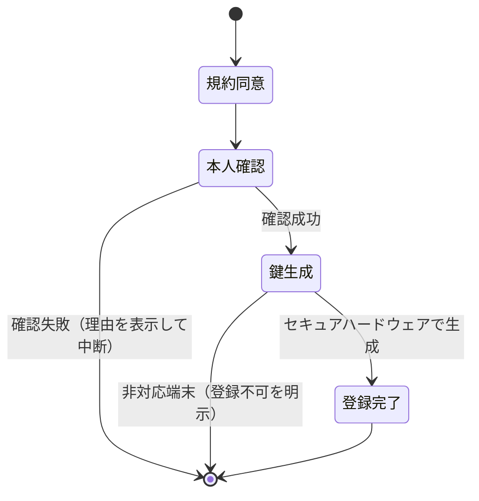
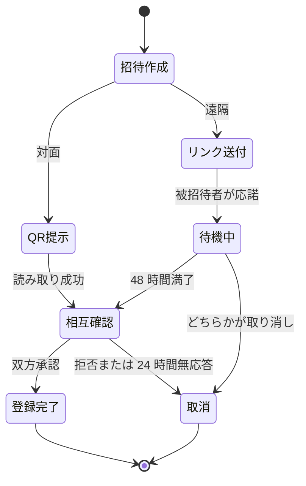
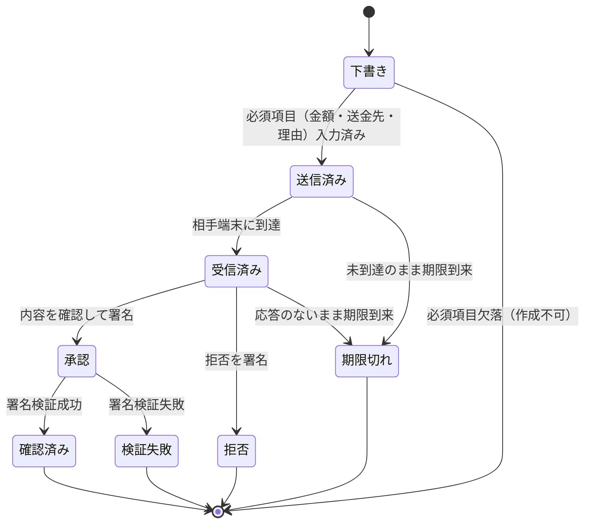
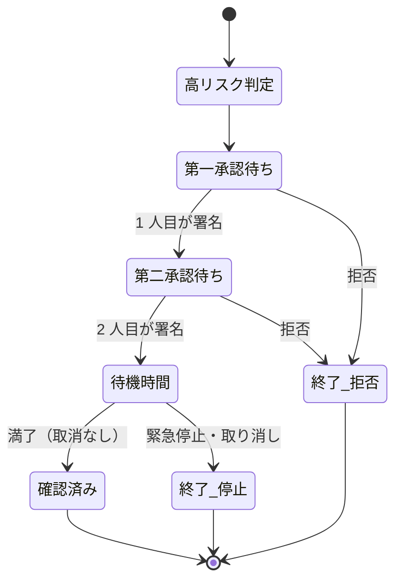
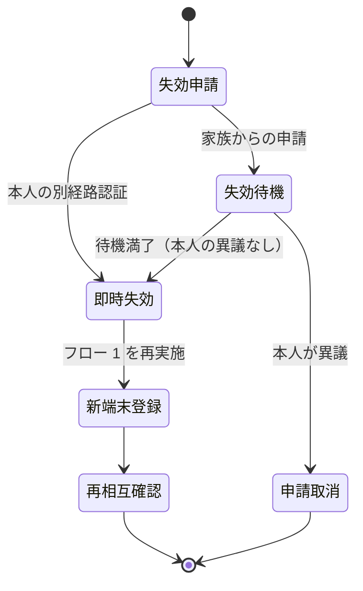
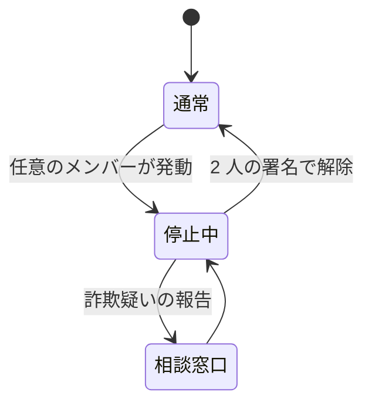

# ユーザージャーニーと状態遷移

エンドツーエンドのユーザージャーニーの正本。通常時だけでなく、詐欺電話の最中・高齢者利用・通信断・相手不応答を含め、誤操作と誤認を防ぐフローを定義する。各フローは開始条件・終了条件・失敗条件を持つ。

正本 Issue: https://github.com/susumutomita/ZeroKeyFamily/issues/3

横断原則（全フロー共通）。

- 「応答なし」を本人確認の成功として扱わない。承認・拒否・期限切れ・応答なし・検証失敗は常に別の状態として扱い、別の表示にする。
- 危険な要求（送金を含む確認要求）では金額・送金先・理由を省略できない。未入力の確認要求は作成段階で拒否する。
- 文言は [安全文言ガイド](./safety-copy-guide.md)、通信断時の挙動は [失敗時・通信断時の挙動一覧](./failure-and-offline-behaviors.md) を正本とする。

## フロー 1: 初回登録・本人確認・端末鍵生成

ユーザーストーリー: 利用者として、自分の端末を「自分の意思表示に使える端末」として登録したい。

- 開始条件: アプリをインストールし、利用規約と [Trust Claims](./trust-claims.md) の要約に同意した。
- 終了条件: 端末のセキュアハードウェア内で鍵ペアが生成され、公開鍵がアカウントに紐づき、ロック解除手段（生体またはパスコード）が署名時の認証として設定された。
- 失敗条件: セキュアハードウェア非対応端末（登録を拒否し、対応端末を案内する）。本人確認の不一致。鍵生成エラー。

設計上の注意: 本人確認は登録時のアカウント保証であり、以後の「確認済み」の根拠は端末鍵の署名である。この区別を完了画面の文言で明示する。

## フロー 2: 家族招待（対面 QR 登録・遠隔登録）

ユーザーストーリー: 利用者として、家族を Trust Circle に追加し、お互いの確認要求に応答できるようにしたい。

### 2a. 対面 QR 登録（推奨経路）

- 開始条件: 双方が登録済み端末を持ち、物理的に同席している。
- 終了条件: 双方の端末が相手の公開鍵を取得し、双方が相手の表示名と関係を確認して相互承認した。
- 失敗条件: QR の有効期限切れ（再生成を案内）。片方のみの承認のまま 24 時間経過（招待を無効化）。

### 2b. 遠隔登録（制限付き経路）

- 開始条件: 招待者が招待リンクを生成し、被招待者が登録済み端末で開いた。
- 終了条件: 48 時間の待機時間が満了し、かつ招待者が待機中に表示される「なりすまし注意」確認を完了して相互承認した。
- 失敗条件: 待機中にいずれかが取り消した。待機時間満了前に承認を完了しようとした（システムが拒否する）。

設計上の注意: 遠隔登録は詐欺師が「家族」として入り込む主要経路になるため、待機時間の短縮オプションを提供しない。

## フロー 3: 確認要求の作成・受信・承認・拒否・期限切れ

ユーザーストーリー: 依頼を受けた利用者として、「電話の相手」ではなく「登録済みの家族の端末」に依頼内容を確認してもらいたい。

- 開始条件: 作成者と確認先が同じ Trust Circle に属し、作成者が依頼の対象・金額・送金先・理由・期限を入力した（送金を含む要求では金額・送金先・理由は必須であり省略できない）。
- 終了条件: 次のいずれかの確定状態に達した。承認（有効な署名を検証済み）、拒否（拒否の署名を検証済み）、期限切れ、応答なし。
- 失敗条件: 署名の検証失敗（「検証失敗」として表示し、承認と区別する）。送信失敗（再送導線を表示する）。

設計上の注意。

- 受信側の承認画面は、金額・送金先・理由・依頼者を一画面に表示し、スクロールなしで読める文字サイズを保つ。
- 承認操作は内容の要約を読み上げた後の二段階操作（スライド + 生体認証）とし、ワンタップで完了させない。
- 「期限切れ」「応答なし」の結果画面は、依頼者側にも「確認できなかった」ことのみを伝え、安心情報として表示しない。

## フロー 4: 高リスク操作の追加確認（高額・緊急・送金先変更）

ユーザーストーリー: 家族として、高額送金や送金先変更が一人の承認だけで成立しない仕組みにしたい。

- 開始条件: 確認要求が [スコープと非目標](./scope-and-non-goals.md) の高リスク条件に該当した。
- 終了条件: 必要な人数の署名が揃い、待機時間が満了した。または、いずれかのメンバーが拒否・緊急停止した。
- 失敗条件: 待機時間の短縮・追加確認の回避が試みられた場合、システムは要求自体を無効化する。

設計上の注意: 「緊急」の表示は待機時間を短縮する理由にならない。むしろ詐欺の典型パターンとして注意文を強調する。

## フロー 5: 相手が応答しない場合の安全な案内

ユーザーストーリー: 確認要求を送った利用者として、相手が応答しないときに「確認できていない」ことを明確に知り、安全な次の行動を選びたい。

- 開始条件: 確認要求が送信済みのまま、応答のない状態が続いている。
- 終了条件: 利用者が次のいずれかを選んだ。期限まで待つ、別の家族へ確認要求を送る、要求を取り消す。
- 失敗条件: 「応答なし」を承認・成功と誤認させる表示（これは実装上の欠陥として扱い、リリースを止める）。

案内の要件。

- 「まだ確認できていません」という状態を最上部に表示し、緑色・チェックマークなど成功を示す視覚要素を使わない。
- 「応答がないことは、相手が本人であることの確認にはなりません」という注意文を常設する。
- 「急かされていませんか」という詐欺注意の導線と、緊急停止・相談窓口への導線を表示する。

## フロー 6: 端末紛失・機種変更・鍵失効・復旧

ユーザーストーリー: 端末を失った利用者として、その端末の鍵を即時に無効化し、新しい端末で再開したい。

- 開始条件: 本人が別経路（バックアップコード・他の自分の登録端末）で失効を申請した。または家族が失効を申請し、待機時間が満了した。
- 終了条件: 旧鍵が失効し、以後の旧鍵による署名が検証で拒否される。新端末でフロー 1 を完了し、家族との再相互確認が済んだ。
- 失敗条件: 失効申請の本人性が確認できない（サポート経由の手動手続きへ誘導する）。失効済み鍵での署名が検証を通過した（実装上の欠陥として扱う）。

設計上の注意: 復旧は鍵の移行ではなく、新規鍵の生成と再登録である。秘密鍵のエクスポート・クラウドバックアップ機能を提供しない。

## フロー 7: 家族からの離脱・死亡・関係解消

ユーザーストーリー: 利用者として、関係が変わったときに Trust Circle から相手または自分を外し、以後の確認要求が届かないようにしたい。

- 開始条件: 本人による離脱操作。または他メンバーによる関係解消の申請（死亡時を含む）。
- 終了条件: 対象メンバーの鍵が当該 Trust Circle で無効化され、双方の画面から確認要求の送受信導線が消えた。過去の確認履歴は監査のため改変せず保持する。
- 失敗条件: 解消後に当該関係での確認要求が成立した（実装上の欠陥として扱う）。

設計上の注意: 死亡時の解消は誤操作・悪用（生存者の排除）を防ぐため、本人への通知と 14 日の異議期間を設ける。

## フロー 8: 誤承認・脅迫・詐欺疑いの緊急停止

ユーザーストーリー: 利用者または家族として、誤って承認した・脅されて承認した・詐欺の疑いがあると気づいたときに、承認の効力を即時に止めたい。

- 開始条件: Trust Circle の任意のメンバーが緊急停止を発動した。発動は単独で可能とする。
- 終了条件: 当該確認要求（および設定により Trust Circle 全体の承認機能）が停止し、全メンバーに通知された。解除には停止発動者以外を含む 2 人の署名を要する。
- 失敗条件: 停止後に当該承認が「確認済み」として外部に提示できた（実装上の欠陥として扱う）。

設計上の注意: 緊急停止の発動はためらいを生まないよう、理由の入力を必須にしない。発動の心理的ハードルを下げることを優先する。

## 関連文書

- [画面ワイヤーフレーム](./wireframes.md)
- [安全文言ガイド](./safety-copy-guide.md)
- [失敗時・通信断時の挙動一覧](./failure-and-offline-behaviors.md)
- [高齢者ユーザビリティテスト計画](./usability-test-plan.md)
