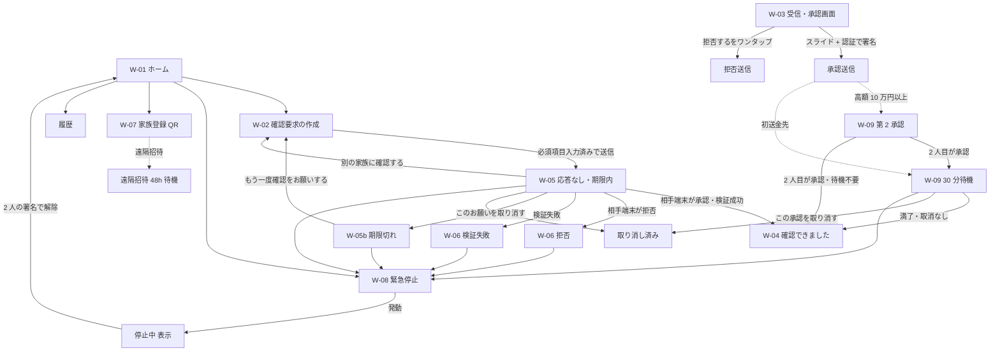

# ZeroKey Family Phase 1 コア機能 デザイン設計書

[仕様書](./2026-06-10-zerokey-family-phase1-core.md) の Designer ロール成果物。画面構成の正本は [wireframes](../product/wireframes.md)、文言の正本は [safety-copy-guide](../product/safety-copy-guide.md)、フローの正本は [user-journeys](../product/user-journeys.md)、失敗時挙動の正本は [failure-and-offline-behaviors](../product/failure-and-offline-behaviors.md) とし、本書はそれらを React コンポーネントと実装要件に落とす。

## 1. UI コンポーネント一覧

### 1.1 画面コンポーネント（W-01〜W-09 対応）

| コンポーネント | 対応ワイヤー | 役割 |
| --- | --- | --- |
| `HomePage` | W-01 | 「家族に確認をお願いする」「困ったとき」の 2 大ボタン、最近の確認リスト、下部ナビ。 |
| `RequestCreatePage` | W-02 | 確認要求の作成フォーム。必須項目（金額・送金先・理由）未入力時は送信ボタンを無効化する。 |
| `RequestReceivePage` | W-03 | 受信した確認のお願いの全文表示と承認（二段階）・拒否（ワンタップ）・電話確認の導線。 |
| `ResultApprovedPage` | W-04 | 「確認できました」。署名者・署名内容の再掲・限界の注意の 3 点を必ず併記する。 |
| `ResultUnansweredPage` | W-05 | 「まだ確認できていません」。期限内・未応答の未確認状態。取り消し・別の家族への確認導線。 |
| `ResultExpiredPage` | W-05b | 「期限までに確認できませんでした」。「期限まで待つ」など不可能な選択肢を出さない。 |
| `ResultRejectedPage` | W-06 | 「確認できませんでした」（拒否）。「お金を送らないでください」を主文に含める。 |
| `ResultVerificationFailedPage` | W-06 | 「応答の検証に失敗しました。安全のため、承認として扱いません。」。拒否と文言を分ける。 |
| `InviteQrPage` | W-07 | 対面 QR 招待。QR 表示・確認番号の照合・「登録する」「やめる」。 |
| `InviteRemoteWaitPage` | フロー 2b | 遠隔招待の 48 時間待機表示。短縮オプションは設けない。 |
| `EmergencyStopPage` | W-08 | 緊急停止の大ボタン（確認ダイアログ 1 回のみ・理由入力なし）、#9110 案内、誤承認導線。 |
| `SecondApprovalPage` | W-09 上段 | 第 2 承認。W-03 と同じ全文表示 + 「すでに花子さんの端末が承認しています」の文脈表示。 |
| `WaitingPeriodPage` | W-09 下段 | 初送金先の 30 分待機。残り時間表示とワンタップ取り消し。 |

### 1.2 再利用コンポーネント（共有単位）

| コンポーネント | 使用画面 | 役割 |
| --- | --- | --- |
| `BigActionButton` | W-01, W-08 | 高齢者向け大ボタン。最小タップ領域 56px、ラベル 20pt 相当以上。 |
| `RequestSummaryCard` | W-02〜W-06, W-09 | 内容・金額・送金先・理由・期限・依頼者の全文表示。省略表示（truncate / 要約）を実装上禁止する唯一の表示単位。金額は 22pt 相当以上。 |
| `StatusBanner` | W-04〜W-06, 通信断 | 状態見出し。アイコン形状 + 文言 + 色の 3 要素セットで状態を表す（後述 3.5）。 |
| `SlideToApprove` | W-03, W-09 | スライド承認トラック。完了で WebCrypto 署名（生体認証相当の確認）へ進む。 |
| `RejectButton` | W-03, W-09 | ワンタップ拒否。`SlideToApprove` と同等以上の視認サイズで配置する。 |
| `HelpEntryButton` | 全画面 | 「困ったとき（緊急停止・相談）」導線。全画面で 2 タップ以内に到達できるよう常設する。 |
| `DangerSignalNotice` | W-03〜W-06, W-09 | 危険シグナル注意文（「今すぐ」検出・初送金先・深夜高額・応答なし時の #9110 案内）。 |
| `CountdownTimer` | W-05, W-09, 招待待機 | 残り時間表示。`aria-live="polite"` で分単位のみ通知し、秒単位の頻繁な読み上げをしない。 |
| `OfflineBanner` | 全画面 | 通信断バナー。状況別文言（後述 4 章）を出し分ける。 |
| `RetryIndicator` | 送信系画面 | 「再試行しています」表示。ユーザーに再送判断を求めない（自動リトライの可視化のみ）。 |
| `FetchedAtLabel` | 結果系画面 | 状態の取得時刻表示。キャッシュ 60 秒超過時は「最新の情報を取得できません」を併記する。 |
| `RequiredFieldNote` | W-02 | 「金額・送金先・理由が空のままでは確認をお願いできません。」の常設注意。 |
| `ConfirmDialog` | W-08, 取り消し | 確認ダイアログ。緊急停止は 1 回のみ、待機中取り消しは理由入力なし。 |

### 1.3 状態と画面の対応（実装欠陥の防止）

結果 5 状態 + 通信断は **別コンポーネント** として実装し、条件分岐による文言切り替えで済ませない。「確認済み」だけが緑・チェックを使えることを `StatusBanner` の型（`variant: 'approved' | 'rejected' | 'unanswered' | 'expired' | 'verification-failed' | 'offline'`）で強制し、approved 以外に緑系トークンを渡せない設計とする。これは failure-and-offline-behaviors の「実装欠陥として扱う挙動」（確認済みと同じ視覚表現の混用）をコンポーネント境界で防ぐためである。

## 2. 画面遷移図とインタラクション仕様

### 2.1 画面遷移図

補足: 高リスク条件（高額 → 第 2 承認、初送金先 → 30 分待機）は独立判定であり、両方該当する場合は第 2 承認の完了後に待機へ入る（user-journeys フロー 4 の重畳）。回避経路となる遷移（待機スキップ・第 2 承認スキップ）は UI 上に存在させない。

### 2.2 承認の二段階操作（W-03 / W-09）

1. **第 1 段階（スライド）**: `SlideToApprove` のつまみをトラック右端（幅の 90% 以上）までドラッグして到達した時点で確定する。途中で離すとアニメーションで初期位置に戻り、署名処理は発生しない。誤タップ・ポケット内タッチで承認が成立しない物理的コストを課す。
2. **第 2 段階（認証 + 署名）**: スライド完了後に確認シートを表示し、`RequestSummaryCard` で内容を再掲したうえで認証（Phase 1 Web 実装では署名直前の明示ボタン、ネイティブでは生体認証）を経て WebCrypto Ed25519 署名を生成する。署名は認証成功まで生成しない（failure-and-offline-behaviors）。
3. スライド到達から 30 秒以内に第 2 段階が完了しない場合は自動でキャンセルし、第 1 段階からやり直しとする（電話で急かされながらの「流れ作業承認」を分断する）。

キーボード・支援技術利用時はスライドの代替として「承認に進む」ボタン（`role="button"`、Enter / Space で起動）を提供し、第 2 段階の確認シートは省略しない。二段階であることはモダリティによらず維持する。

### 2.3 拒否がワンタップである理由

拒否は `RejectButton` のワンタップ + 即時送信で完了し、確認ダイアログを出さない。

- **安全側の非対称性**: 誤拒否の被害は「もう一度確認を依頼する手間」だが、誤承認の被害は「送金の実行」であり不可逆性が異なる。操作コストを被害の大きさに比例させる（wireframes W-03「拒否の方を軽くする」）。
- **心理的ハードルの除去**: 受信者は「家族の頼みを断る」ことにためらいを感じやすい。確認ダイアログ（「本当に拒否しますか」）はためらいを増幅し、不審な要求の承認へ誘導しかねないため置かない。
- **詐欺対応の即応性**: 身に覚えのない要求は 1 動作で「身に覚えがない」と回答でき、依頼者側に「お金を送らないでください」が即時表示される。

同じ非対称性原則を W-09 の待機中取り消し（理由入力なしワンタップ）と W-08 の緊急停止（確認ダイアログ 1 回のみ・理由入力なし）にも適用する。**止める操作・断る操作は常に進める操作より軽い。**

### 2.4 その他のインタラクション仕様

- W-02 の送信ボタンは必須 3 項目（金額・送金先・理由）が揃うまで `disabled` + `aria-disabled="true"` とし、無効中のタップで欠落項目へフォーカスを移動して欠落を読み上げる。サーバー側 400 はクライアント検証の二重防御であり、UI はサーバーエラー時も欠落項目を明示する。
- W-05 の選択肢は「別の家族に確認する」「このお願いを取り消す」「困ったとき」「期限まで待つ」の順とし、安全な行動を上に置く。W-05b では「期限まで待つ」を表示しない。
- 受信画面（W-03）は金額・送金先・理由・依頼者を一画面・スクロールなしで表示する。`RequestSummaryCard` に省略表示を実装しないことで担保する。
- 停止中の Trust Circle では承認系操作（スライド・送信）を無効化し、「いま家族グループは停止中です」を表示する（API の 409 を UI 状態に反映する）。

## 3. アクセシビリティ要件（WCAG 2.1 AA）

### 3.1 コントラスト

- 本文テキストは背景に対しコントラスト比 4.5:1 以上（SC 1.4.3）。大きいテキスト（金額 22pt 相当以上・見出し）は 3:1 以上だが、本プロダクトでは安全文言の確実な可読性のため全テキストを 4.5:1 以上に統一する。
- UI 部品（スライダートラック・ボタン境界・フォーカスリング・状態アイコン）は隣接色に対し 3:1 以上（SC 1.4.11）。
- デザイントークンとして `--color-text-on-*` を状態色ごとに定義し、Biome / CI でのトークン外カラーコード直書きをレビュー対象とする。

### 3.2 フォーカス順序とキーボード操作

- DOM 順 = 視覚順 = フォーカス順とし、`tabindex` の正値を使わない（SC 2.4.3）。
- W-03 のフォーカス順: 見出し → 依頼者 → `RequestSummaryCard`（内容 → 金額 → 送金先 → 理由 → 期限）→ 「この内容に心当たりがありますか。」→ 承認 → 拒否 → 電話確認 → 困ったとき。**内容をすべて通過しないと操作ボタンに到達しない順序** を維持する。
- すべての操作はキーボードのみで完結する（SC 2.1.1）。スライド承認の代替は 2.2 のとおり。
- フォーカスリングは 2px 以上のアウトライン + 2px オフセットで全インタラクティブ要素に表示し、`outline: none` の打ち消しを禁止する（SC 2.4.7）。
- モーダル（第 2 段階確認シート・緊急停止ダイアログ）はフォーカストラップ + 閉鎖時の呼び出し元への復帰を実装する。

### 3.3 読み上げラベル（スクリーンリーダー）

- 状態見出しのアイコン（✓ / ✕ / ？ / ⚠ / ⏳）は装飾扱い（`aria-hidden="true"`）とし、状態は `StatusBanner` のテキストで読み上げる。文言は safety-copy-guide の標準文言そのものを使う（例: 「太郎さんの登録端末が、この内容に同意の署名をしました。」）。
- 状態の変化（応答なし → 確認済み等、通信断バナーの出現）は `aria-live="assertive"` のリージョンで通知する。再試行表示・カウントダウンは `aria-live="polite"`。
- `SlideToApprove` は `role="slider"` 相当ではなく「承認に進む」ボタンとして公開し、`aria-label="承認に進む。次の画面で内容をもう一度確認します"` を付ける。
- 金額は `aria-label="金額 30 万円"` のように位取りを読みやすい形で併記する（「300,000」の桁読み誤りを防ぐ）。
- フォーム必須項目は `<label>` 関連付け + `aria-required="true"`、エラーは `aria-describedby` で欠落理由を結びつける。
- 履歴・結果の主語は読み上げでも「太郎さんの端末」とし、「太郎さん」と読み上げない（trust-claims との整合）。

### 3.4 最小フォントサイズ（17pt 相当）

- ルートを 100%（16px）基準とし、本文最小サイズをトークン `--font-body: 1.4375rem`（23px ≒ 17pt）で定義する。金額は `--font-amount: 1.875rem`（30px ≒ 22pt）以上 + 太字。
- すべてのフォント指定は rem で行い、px 直書きを禁止する。これにより OS / ブラウザの文字拡大設定（200% まで、SC 1.4.4）に追従し、200% 拡大時も W-03 の必須情報が横スクロールなしで読めることをテストで確認する。
- 行間は 1.5 以上、段落間は 1 文字分以上（SC 1.4.12 互換）。

### 3.5 色のみに依存しない状態表示

`StatusBanner` の variant ごとに **アイコン形状・文言・色の 3 要素** を固定でセットにし、色を取り除いても状態が判別できるようにする（SC 1.4.1）。

| variant | アイコン形状 | 主文言（先頭） | 色系統 |
| --- | --- | --- | --- |
| approved | ✓（チェック） | 確認できました | 緑 |
| rejected | ✕（バツ） | 確認できませんでした | 赤 |
| verification-failed | ✕（バツ） | 応答の検証に失敗しました | 赤 |
| unanswered | ？（疑問符） | まだ確認できていません | グレーまたは黄 |
| expired | ✕（バツ） | 期限までに確認できませんでした | グレー |
| offline | ⚠（注意） | 確認の状態がわかりません | 黄 |

- 緑とチェックマークは approved 専用とし、他 variant への流用を型で禁止する（1.3 参照）。unanswered に成功を示す視覚要素を使わないことは user-journeys フロー 5 の失敗条件（リリースブロッカー）に直結する。
- フォーム検証エラーも赤色のみに頼らず、アイコン + 「金額が入力されていません」の文言で示す。
- タップ領域は最小 44×44px（主要操作は 56px 以上）とする（SC 2.5.5 AAA 相当を採用）。

## 4. エラー状態・空状態・ローディング状態の設計

failure-and-offline-behaviors の状況別挙動一覧と 1:1 で対応させる。文言は safety-copy-guide の標準文言を一語一句使う。

### 4.1 通信断（オフライン）

| 状況 | 表示コンポーネント | 表示内容 |
| --- | --- | --- |
| 作成中（W-02）に通信断 | `OfflineBanner` | 「インターネットに接続できていません。接続後に送信できます。」下書きは端末内に保存し、回復後も **明示操作でのみ送信**（自動送信しない）。 |
| 結果取得中（W-04〜W-06 への遷移時）に通信断 | `StatusBanner variant="offline"` | 「インターネットに接続できていないため、確認の状態がわかりません。確認できるまで、お金を送らないでください。」キャッシュの古い状態を「最新」として表示せず、`FetchedAtLabel` で取得時刻を必ず併記する。 |
| 署名生成後・送信前に通信断（W-03） | `RetryIndicator` | 「回答を送信しています。」署名は端末内に保持し回復後送信。期限超過時は破棄して双方に期限切れを表示する。 |
| 緊急停止の発動中に通信断（W-08） | 専用バナー | 「停止の依頼を送信しています。送信できるまで停止は有効になりません。電話での連絡もしてください。」家族への電話・#9110 を画面に表示する。受理前であることを隠さない。 |
| QR 読み取り中の通信断（W-07） | エラー表示 | 「接続できないため登録を進められません。」片側のみ登録の中間状態を作らない。 |

通信断中に「確認済み」をキャッシュから取得時刻なしで表示することは実装欠陥（リリースブロッカー）であり、結果系画面は「状態データ + 取得時刻」を常にペアで receive する props 設計とする。

### 4.2 エラー状態

| 状況 | 表示 | 設計 |
| --- | --- | --- |
| 送信失敗（サーバー未達） | 「送信できませんでした。再試行しています。」 | 指数バックオフ最大 5 回・nonce 同一で自動再送。`RetryIndicator` で再試行中のみ表示し、ユーザーに再送判断を求めない。5 回超で手動再送ボタンを表示する。 |
| 署名の検証失敗 | `ResultVerificationFailedPage` | 「応答の検証に失敗しました。安全のため、承認として扱いません。」「エラーが発生しました」だけの表示を禁止する。 |
| 失効済み鍵による署名 | 同上の variant | 「この端末は使えなくなっています。承認として扱いません。」 |
| 期限・nonce 不一致（リプレイ） | エラー画面 | 「このお願いはすでに無効です。」 |
| 受信内容の改ざん検出（W-03） | エラー画面 | 「このお願いは安全に表示できません。」要求は無効化され、依頼者側に検証失敗を表示する。 |
| サーバー全面障害 | 全画面エラー | 「現在サービスを利用できません。お金の確認はサービスの回復を待つか、直接会って確かめてください。」縮退して承認だけ通す UI を作らない。 |
| フォーム必須欠落（API 400 含む） | インラインエラー | 欠落項目を明示し送信ボタン無効化。`aria-describedby` で関連付ける。 |

すべてのエラー画面・失敗画面に `HelpEntryButton`（困ったとき）を置く（fail-safe 原則 5）。

### 4.3 空状態

| 画面 | 空状態の表示 |
| --- | --- |
| W-01 最近の確認 | 「まだ確認の履歴がありません。」+ 「家族に確認をお願いする」への案内。空でも 2 大ボタンの配置・サイズは変えない。 |
| 履歴 | 「確認の履歴はここに表示されます。」 |
| 家族の管理（メンバー 0 人） | 「まだ家族が登録されていません。」+ W-07 への導線。**確認要求の作成は家族 0 人では開始できない** ことを明示する。 |
| 受信一覧（お願いなし） | 「いま届いている確認のお願いはありません。」安心情報（「問題ありません」等）として表現しない。 |

### 4.4 ローディング状態

- **結果取得中**: スケルトンやスピナーのみで放置せず、「確認の状態を調べています。」のテキストを併記する。60 秒（キャッシュ許容）を超えたら「最新の情報を取得できません」を併記し、`variant="offline"` 系の案内に切り替える。
- **送信中**: ボタンを無効化し「送信しています。」を表示する。二重送信は nonce で防がれるが、UI でも連打を抑止する。
- **署名処理中（第 2 段階）**: 「同意の署名を作成しています。」を表示する。この間に画面を閉じても署名は送信されない（認証 + 署名完了が送信条件）。
- **ローディング中に承認系の結果を推定表示しない**: 楽観的 UI（optimistic update）を承認・確認済み表示に使うことを禁止する。「確認済み」は検証完了レスポンスを受けた後にのみ描画する（部分的成功を成功として表示しない原則）。
- すべてのローディング表示は `aria-busy="true"` + `aria-live="polite"` の状態通知を伴う。

## 関連文書

- [仕様書: ZeroKey Family Phase 1 コア機能](./2026-06-10-zerokey-family-phase1-core.md)
- [画面ワイヤーフレーム](../product/wireframes.md)
- [安全文言ガイド](../product/safety-copy-guide.md)
- [ユーザージャーニーと状態遷移](../product/user-journeys.md)
- [失敗時・通信断時の挙動一覧](../product/failure-and-offline-behaviors.md)
